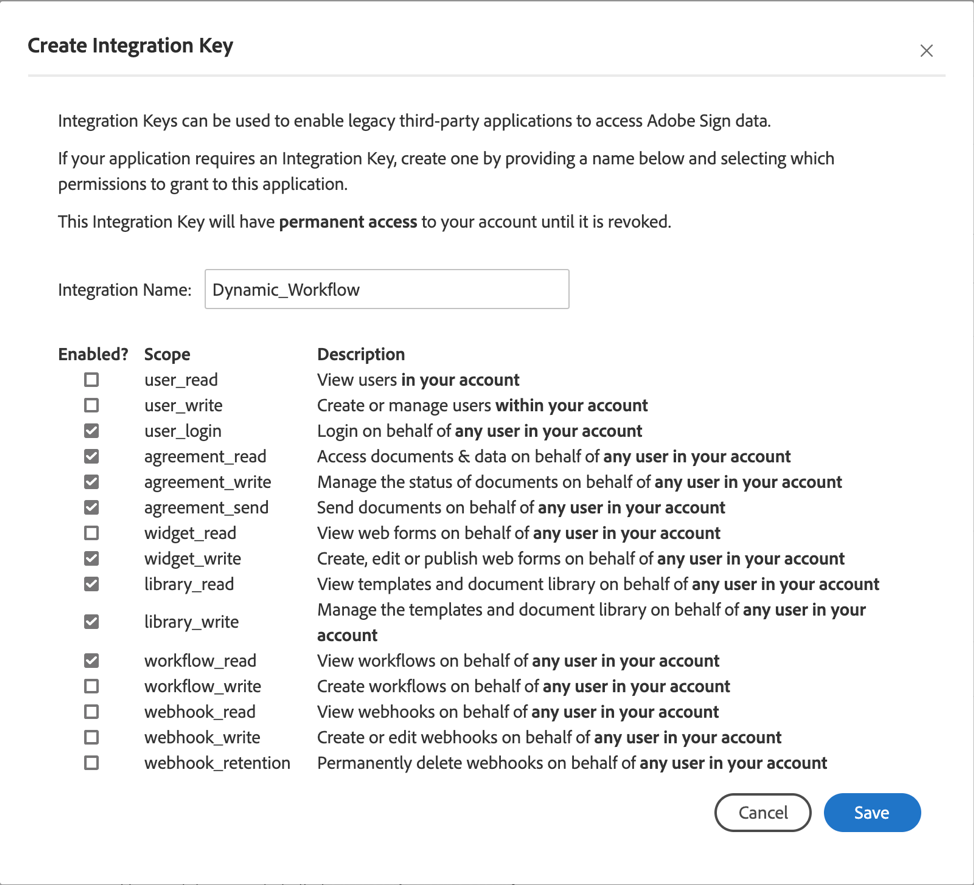

# Dynamic Workflow v1.1
Dynamic Workflow built on top of express using Adobe Sign API.


## Overview
Dynamic workflows allow users to specify the next participants within an agreement.

## Disclaimer
This application is currently on version 1.1. There is a known issue that has been submitted to JIRA for participant groups. The feature is currently there, but the functionality has a bug. Once this issue is resolved, a patch will be issued out.

## Features
| Features | Description |
| --- | --- |
| Dynamic Routing | Allows user to provide the next participant associated with the workflow. |
| Hide All Workflow w/ Predefined Recipients | Allows the application to hide workflows with predefined recipients. |
| Hide Target Workflows w/ Predefined Recipients | Specify which workflows you want to only hide predefined recipients. |
| CSS Theme | Easily change the theme by adjusting CSS variables |
| Sender Input Fields | Allow workflow sender input fields to be replicated over into the form. |
| Upload Documents | Allow the sender to upload additional documents if enabled in workflow. |
| Recipient Groups | Allows you to have the ability to dynamically route to recipient groups.  *As of version 1.1, this feature is blocked please see disclaimer.* |

## Deployment Instructions
This is a server-side version of the Dynamic Workflow application. You must host and deploy this application for it to work. There are many methods of deploying an application. In this example, I will be deploying it to Digital Ocean. Feel free to choose whichever platform/services and use this documentation as a guideline.

### Digital Ocean
1. Click create and select droplet
2. Choose an image. We will be going with Ubuntu 18.04.3 LTS x64
3. Choose a plan that best fits your business needs. For demo purposes, I will be choosing a Standard plan at $5/mo
4. Select your preferred datacenter region
5. Select any additional options
6. Choose an SSH for the authentication method
7. Create an SSH key for your droplet
8. Choose a hostname
9. Click create droplet
10. SSH into your server

### Node.js
```sh
# Refresh your local package index with the following command
sudo apt update

# Install Node.js from repositories
sudo apt install nodejs

# Install node packaging manager
sudo apt install npm
```

### Importing Source File
There are two options to import your source file.  Git or FTP.
1. **Git:** In the appropriate dir, execute `git clone {url_to_repo}`
2. **FTP:** You can use whichever tool you prefer tool, like [Cyberduck](https://cyberduck.io/).

### Install Dependencies

You will need to install all dependencies associated with this application
```sh
cd Dynamic/Workflow
npm install
```

### Installing nodemon
Use nodemon as a dev node on production. *We will use pm2 as our process manager*

```sh
npm install -g nodemon
npm start dev # Use only for development
```

### Default port 80
To run application on default port 80 install lib2cap-bin
```sh
sudo apt-get install lib2cap-bin
sudo setcap cap/net/bind/service=+ep `readlink -f \`which node\``
```

### Install pm2
Install pm2 to and run application in the background
```sh
npm install pm2 -g
pm2 start ~/Dynamic/Workflow/server.js
```

## Configuration
There is a sample configuration file, `config/config.sample.yaml`, that needs to be copied to `config/config.yaml` and modified for your environment.

There are three main components within the configuration file.

### Server
- `host`: The host address to your Sign Console.
- `endpoint`: This is the API endpoint

### Enterprise
- `integration`:   This is your integration key for Adobe Sign. Please see the integration key section.

## Features

- `hide_predefined`: This turns on the feature to hide predefined recipients in your workflow.
  - `yes`: Turn on
  - `no`: Turn off
- `hide_workflow_list`: A list to target specific workflows to hide predefined recipients.

## Integration Key
You will be required to create an integration key with limited scopes for this application and add the integration key inside the config.yaml file. [Click Me](https://helpx.adobe.com/sign/kb/how-to-create-an-integration-key.html)


